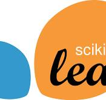

<link
  rel="stylesheet"
  href="https://cdn.jsdelivr.net/gh/dheereshagrwal/colored-icons@1.7.4/src/app/ci.min.css"
/>

    

&nbsp;

&nbsp;

## 👨 About Me

I'm a self-taught developer currently pursuing my passion for data science at Turing College and co-author of the [df-squeezer package](https://pypi.org/project/df-squeezer/), a tool designed to optimize data frame manipulation. 

My interests lie in the fascinating realm of computer vision, robotics and automation and AI applications in the medical sector. I believe that these areas have the potential to transform the way we live and work, and I'm excited to be a part of this transformation.

&nbsp;

## 🛠️ Tools:

    

        Python <i class="ci ci-python ci-2x" style="margin-left: 5px;"></i>
    

    

        Pandas 
    

    

        Numpy 
    

    

        Matplotlib 
    

    

        Seaborn 
    

    

        Scikit Learn 
    

    

        XGBoost 
    

    

        Optuna 
    

    

        SHAP 
    

    

        FastAI 
    

    

        Docker <i class="ci ci-docker ci-2x" style="margin-left: 5px;"></i>
    

    

        Google Cloud <i class="ci ci-google ci-2x" style="margin-left: 5px;"></i>
    

    

        Kotlin 
    

    

        HTML 
    

    

        JavaScript 
    

    

        SQL 
    

    

        GCODE 
    

    

        Tableau 
    

    

        Looker Studio 
    

&nbsp;

## 🏗️ My Current Role

As a ship-to-shore crane operator on the largest terminal in Europe, I have gained a unique perspective on the importance of efficiency, safety, and automation in the industry. This hands-on experience has further fueled my interest in robotics and automation, inspiring me to delve deeper into the world of programming and data science to find innovative solutions that can revolutionize the way we work.

Here's a view from my office:

</img>

&nbsp;

## 🌐 Let's Connect!

I'm always open to connecting with like-minded individuals, so feel free to reach out to me on GitHub or any other platform. Let's work together to create a smarter, more efficient, and healthier future!

<!---
kkalera/kkalera is a ✨ special ✨ repository because its `README.md` (this file) appears on your GitHub profile.
You can click the Preview link to take a look at your changes.
--->
