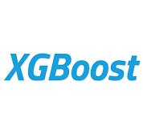
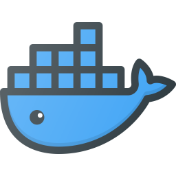
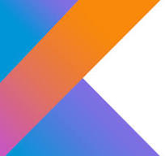

<link
  rel="stylesheet"
  href="https://cdn.jsdelivr.net/gh/dheereshagrwal/colored-icons@1.7.4/src/app/ci.min.css"
/>

    

&nbsp;

&nbsp;

## 👨 About Me

I'm a self-taught developer, pursuing my passion for data science at Turing College and co-author of the [df-squeezer package](https://pypi.org/project/df-squeezer/), a tool designed to optimize dataframe memory usage. 

My interests lie in the fascinating realm of computer vision, robotics and automation and AI applications in the medical sector. I believe that these areas have the potential to transform the way we live and work, and I'm excited to be a part of this transformation.

&nbsp;

## 🛠️ My Ever Expanding Toolbox:

<b >Python &nbsp; &nbsp;&nbsp;&nbsp;|&nbsp;&nbsp;&nbsp;</b>
<b >Pandas &nbsp; &nbsp;&nbsp;&nbsp;|&nbsp;&nbsp;&nbsp;</b>
<b >Numpy &nbsp;&nbsp;&nbsp;&nbsp;|&nbsp;&nbsp;&nbsp;</b>
<b >Matplotlib &nbsp;&nbsp;&nbsp;&nbsp;|&nbsp;&nbsp;&nbsp;</b>
<b >Seaborn &nbsp;&nbsp;&nbsp;&nbsp;|&nbsp;&nbsp;&nbsp;</b>
<b >Scikit Learn &nbsp;&nbsp;&nbsp;&nbsp;|&nbsp;&nbsp;&nbsp;</b>
<b >XGBoost &nbsp;&nbsp;&nbsp;&nbsp;|&nbsp;&nbsp;&nbsp;</b>
<b >Optuna &nbsp;&nbsp;&nbsp;&nbsp;|&nbsp;&nbsp;&nbsp;</b>
<b >SHAP &nbsp;&nbsp;&nbsp;&nbsp;|&nbsp;&nbsp;&nbsp;</b>
<b >FastAI &nbsp;&nbsp;&nbsp;&nbsp;|&nbsp;&nbsp;&nbsp;</b>
<b >Docker &nbsp;&nbsp;&nbsp;&nbsp;|&nbsp;&nbsp;&nbsp;</b>
<b >Google Cloud &nbsp;&nbsp;&nbsp;&nbsp;|&nbsp;&nbsp;&nbsp;</b>
<b >SQL &nbsp;&nbsp;&nbsp;&nbsp;|&nbsp;&nbsp;&nbsp;</b>
<b >Tableau &nbsp;&nbsp;&nbsp;&nbsp;|&nbsp;&nbsp;&nbsp;</b>
<b >Looker Studio &nbsp;&nbsp;&nbsp;&nbsp;|&nbsp;&nbsp;&nbsp;</b>
<b >HTML &nbsp;&nbsp;&nbsp;&nbsp;|&nbsp;&nbsp;&nbsp;</b>
<b >Javascript &nbsp;&nbsp;&nbsp;&nbsp;|&nbsp;&nbsp;&nbsp;</b>
<b >Java &nbsp;&nbsp;&nbsp;&nbsp;|&nbsp;&nbsp;&nbsp;</b>
<b >Kotlin &nbsp;&nbsp;&nbsp;&nbsp;|&nbsp;&nbsp;&nbsp;</b>
<b >Android &nbsp;</b>

&nbsp;

## 🏗️ My Current Role

As a ship-to-shore crane operator on the largest terminal in Europe, I have gained a unique perspective on the importance of efficiency, safety, and automation in the industry. This hands-on experience has further fueled my interest in robotics and automation, inspiring me to delve deeper into the world of programming and data science to find innovative solutions that can revolutionize the way we work.

Here's a view from my office:

</img>

&nbsp;

## 🌐 Let's Connect!

I'm always open to connecting with like-minded individuals, so feel free to reach out to me on GitHub or any other platform. Let's work together to create a smarter, more efficient, and healthier future!

<!---
kkalera/kkalera is a ✨ special ✨ repository because its `README.md` (this file) appears on your GitHub profile.
You can click the Preview link to take a look at your changes.
--->
